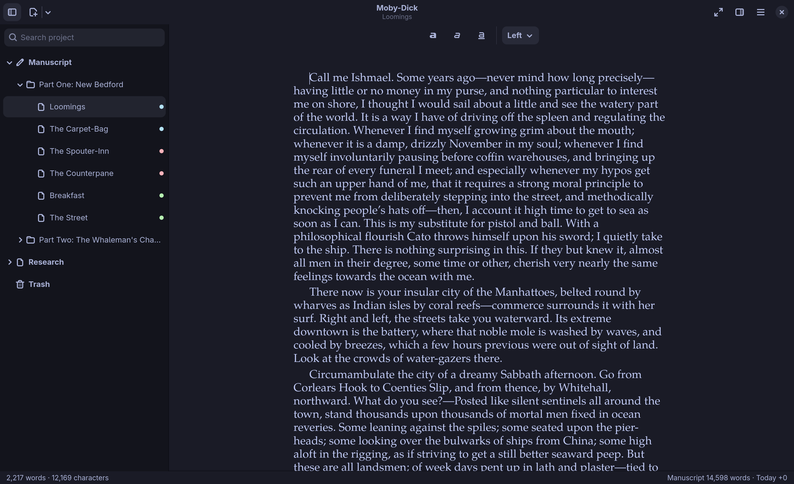

# omaquill

omaquill is a free writing studio, written from scratch, for authors and
writers on Linux and [Omarchy](https://omarchy.org). Scrivener has no Linux
version. You can start a fresh novel here.

It has a binder, a corkboard, an outliner, and an inspector. Composition
mode is full screen, just the text. Compile writes DOCX, PDF, and EPUB,
plus Markdown, plain text, and RTF.



Projects are Scrivener 3 `.scriv` folders. You can open one you already
wrote on a Mac. A novel you start here is a folder you can copy to someone
who uses Scrivener. You are not locked into a private format. See
[What carries over](#what-carries-over) for what is kept. Opening an
edited project in Scrivener itself has not been tested yet.

The app is written in Rust, with GTK 4 and libadwaita. The Scrivener
reader and writer, the RTF engine, and the DOCX and EPUB writers are
omaquill's own. The only dependencies are GTK and libadwaita, plus GTK's
own Pango and Cairo for PDF layout. The Omarchy theme colors the window
and follows theme changes live.

**Status: v0.1.** It's for writing. Most of Compile's options, snapshots,
and the text of comments and footnotes aren't here yet. See
[What carries over](#what-carries-over).

**Safe to try.** omaquill makes a backup before every open. A document you
don't edit is never rewritten. To read a project and change nothing, run
`omaquill check "Novel.scriv"`.

To install the app and the bar widget, run this command.

```sh
git clone https://github.com/shieldsworks/omaquill ~/.local/share/omaquill/src && bash ~/.local/share/omaquill/src/scripts/install-local.sh --plugin
```

## Install

omaquill is two pieces from this one repository: the **app**, a GTK 4
program built from source, and the **bar widget**, an Omarchy shell plugin
(`io.github.shieldsworks.omaquill`) showing today's word count. The widget
opens the app when clicked, so install both.

**Needs:** GTK 4.12+ and libadwaita 1.5+ (already on Omarchy), and Rust
to build. With [mise](https://mise.jdx.dev) (on Omarchy already) the install
script fetches the exact Rust version this repository pins; otherwise
install `rustup`. The build downloads its Rust crates (the GTK bindings)
from crates.io once. Nothing else runs as root, and nothing is fetched
while you use it.

From the Omarchy plugin marketplace, or by hand, add the widget, then
build the app from the same checkout:

```sh
omarchy plugin add https://github.com/shieldsworks/omaquill --enable
bash ~/.config/omarchy/plugins/io.github.shieldsworks.omaquill/scripts/install-local.sh
```

Or clone it anywhere and let the script do both:

```sh
git clone https://github.com/shieldsworks/omaquill ~/.local/share/omaquill/src
bash ~/.local/share/omaquill/src/scripts/install-local.sh --plugin
```

The script builds a release, puts `omaquill` in `~/.local/bin`, and adds
it to the app launcher with its icon. `.scrivx` files open in it. It
changes no existing configuration. There's also an AUR-style
`packaging/PKGBUILD`.

To update, pull (or `omarchy plugin update io.github.shieldsworks.omaquill`)
and run `install-local.sh` again.

## Remove

```sh
bash scripts/uninstall-local.sh            # the app: binary, launcher entry, icon, file type
omarchy plugin remove io.github.shieldsworks.omaquill   # the bar widget
```

Your projects are never touched. omaquill's own settings
(`~/.config/omaquill`), state (`~/.local/state/omaquill`) and your project
backups (`~/.local/share/omaquill/backups`) stay until you delete them
yourself.

For text that looks like it did on the Mac, install the optional
`tex-gyre-fonts` package from the Arch repositories. Its fonts closely
match Palatino, Times, Helvetica and Courier.

Your files keep their original font names either way. The stand-ins are
only used on screen.

## Start a new project

Choose **New Project…** from the menu, or press Ctrl+Shift+O. The welcome
page has the same button. You see that page when omaquill has no project
to reopen. When you already have a project, omaquill opens your last one.
The menu item and the shortcut work either way.

The dialog asks where to save the project. The name starts as
`Untitled.scriv`. If the name does not already end in `.scriv`, omaquill
adds it. The folder must not already exist.

The new folder is a Scrivener 3 project. The binder starts with
Manuscript, Research, and Trash. Manuscript contains one empty document,
Chapter One. Write there, or add a document or a folder from the binder.

The app creates the project. No terminal command creates one.
`omaquill check` and `omaquill compile` read a `.scriv` folder that
already exists. `omaquill` on its own opens the app.

## Already use Scrivener?

Copy the whole `.scriv` folder across: AirDrop to a phone and back, a USB
stick, `scp`, a synced folder, whatever works. With iCloud or Dropbox, make
sure every file has finished downloading first. Then open the `.scriv`
folder from omaquill (Ctrl+O), or run `omaquill path/to/Novel.scriv`.

Before editing, you can have omaquill read the whole project without
changing anything:

```sh
omaquill check "Novel.scriv"
```

It reports what it found and names any document with things omaquill shows
as plain text (see below).

## Use

The window works like Scrivener's:

- **Binder** (left): the project's folders and documents. Drag a row onto
  another's top or bottom edge to put it before or after, or onto its
  middle to put it inside. Right-click for New, Rename, Move to Trash.
- **Editor** (middle): the selected document. Selecting a folder shows its
  **corkboard** of index cards or its **outliner** (Ctrl+2, Ctrl+3). Ctrl+1
  shows a folder's own text.
- **Inspector** (right): title, label, status, Include in Compile, the
  synopsis (the card's text) and notes.

omaquill saves as you type: a second and a half after you stop, and whenever
you switch documents or close.

| Keys | |
|---|---|
| Ctrl+Shift+O | New project |
| Ctrl+N / Ctrl+Shift+N | New text / new folder |
| F2 | Rename |
| Ctrl+B, Ctrl+I, Ctrl+U | Bold, italic, underline |
| Ctrl+F | Find in the document |
| Ctrl+Shift+F | Search the whole project |
| F11 | Composition mode: full screen, just the text (Esc leaves) |
| Ctrl+1 / 2 / 3 | Text / corkboard / outliner |
| Ctrl+Alt+K / J | Move the item up / down |
| Ctrl+Alt+L / H | Indent / outdent (into the item above / out of its folder) |
| j k h l | Move and fold in the binder, when it has focus |
| Ctrl+Alt+1 / 2 | Focus the binder / the editor |
| Ctrl+Alt+B / I | Show or hide the binder / inspector |
| Ctrl+plus / minus / 0 | Zoom |
| Ctrl+Shift+E | Compile |
| Ctrl+? | All the shortcuts |

## Compile

Ctrl+Shift+E compiles everything in the Manuscript folder that's marked
Include in Compile, in binder order. Each top-level item is a chapter; a
folder's documents are its scenes, separated by `#`. The formats:

- **Word (DOCX)**. By default in standard manuscript format: Times 12 pt,
  double spaced, 1" margins, 0.5" indents, a title page with your name and
  word count, and a running header. Turn that off to keep the text's own
  formatting.
- **PDF**, in either of two layouts, picked by the same switch:
  - **Standard manuscript**: US Letter, Times 12 pt double spaced, title
    page with word count, "Surname / TITLE / page" header. The same look
    as the Word file.
  - **Paperback** (switch off): a 6×9" page with mirrored margins,
    justified and hyphenated text in your book's own typeface (TeX's
    hyphenation patterns, words of six letters or more, never more than
    two hyphenated lines in a row), chapters opening
    a third of the way down, running heads and page numbers. For proofreading or
    a self-publishing draft.

  Fonts are embedded. With `tex-gyre-fonts` installed, a Palatino book
  prints in its close match, TeX Gyre Pagella.
- **EPUB**, **Markdown**, **plain text** and **RTF**.

From a terminal, too:

```sh
omaquill compile "Novel.scriv" novel.docx --author "Your Name"
omaquill compile "Novel.scriv" novel.pdf              # manuscript
omaquill compile "Novel.scriv" book.pdf --book        # paperback
omaquill compile "Novel.scriv" novel.epub
```

## What carries over

omaquill changes only what you change. A document you don't edit is never
rewritten, and neither is anything in the project it doesn't understand:
compile settings, section types, targets, collections and the rest stay
exactly as Scrivener left them.

**Read and written:** the binder (folders, documents, order, nesting,
Trash); document text with fonts, sizes, bold, italic, underline,
strikethrough, color, highlight, super/subscript, alignment, indents,
paragraph spacing, line height and tab stops; links, including links
between documents and the anchors of Scrivener's comments and footnotes
(shown highlighted; their text stays in Scrivener's comments file,
untouched); synopses; notes; labels; status; Include
in Compile; titles; new documents and folders; the project search index and
checksums, updated the way Scrivener does.

**Shown, not editable:** images and PDFs in the binder. PDFs open in your
PDF viewer.

**Shown as plain text:** bullet and numbered lists (you see the markers),
tables (cells separated by tabs), inline images, and older-style inline
footnotes and annotations.
When a document has any of these, a banner says so. omaquill keeps them
until you edit that document; if you do, the words stay but that layout
goes.

**Not yet:** reading or writing the text of comments and footnotes,
Scrivenings (editing several documents as one), snapshots, collections,
keywords, custom metadata, project targets, and most of Scrivener's Compile
options. Undo brings back deleted words but not their formatting (italics
come back plain), a limit of GTK's undo; retype or reformat them.

The RTF omaquill writes has been checked against macOS's own RTF reader
(the one Scrivener uses): a real novel with every document rewritten, plus
a scene using every kind of formatting, read back by `textutil` with the
same text in every file and the same bold and italic. Opening an
omaquill-edited project in Scrivener itself hasn't been tested yet; if you
have Scrivener, a report either way is welcome.

omaquill is built for moving to Linux, not for going back and forth. A
project it has edited still opens in Scrivener, but a document edited here
loses any Scrivener-only formatting listed above.

## Safety

- Every time omaquill opens a project, it zips the whole thing into
  `~/.local/share/omaquill/backups/` before changing anything. It keeps the
  last 10 per project; Preferences changes that.
- Files are written to a temporary name and renamed into place, so a crash
  or power cut never leaves half a chapter.
- Logging out or shutting down closes the window cleanly and saves.

## The Omarchy bar widget

`io.github.shieldsworks.omaquill` shows the words you've written today, like `󰏫 312/500`
with a daily target set in Preferences. It's highlighted once you reach the
target. Click it to open omaquill (see [Install](#install); the widget does
nothing else without the app). The widget reads `~/.local/state/omaquill/today.json`, which the app keeps
current as you type.

## Development

```sh
mise install       # the Rust toolchain
mise test          # unit and project tests
mise lint          # rustfmt + clippy, warnings denied
mise start         # build and run
```

The tests use `tests/fixtures/Lighthouse.scriv`, a small made-up project
laid out the way Scrivener 3 writes one. To also run a real project through
the reader, the GTK round trip, and a comparison with Scrivener's own
search index and checksums (all read-only):

```sh
OMAQUILL_REAL_PROJECT=~/Novel.scriv cargo test
```

Code map: `src/xml.rs` (a lossless XML tree for the `.scrivx`), `src/rtf.rs`
(RTF in and out), `src/project.rs` (the project on disk), `src/compile.rs`,
and `src/ui/` (the app; `rich.rs` moves text between RTF and GTK's text
buffer).

## License

MIT
